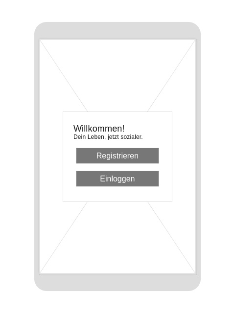

# Socialize
Socialize, ein Projekt von Leon Pakzad, Zahra Abdi und Robert Ackermann. Entwickelt mit Kotlin und Jetpack Compose. Made with ♥ and ☕ in Erfurt.

## Allgemein
### Projektstruktur
```
├── MainActivity.kt
├── config
│   └── config.kt
├── models
│   ├── AuthTokenData.kt
│   ├── AuthUser.kt
│   ├── ChatEntry.kt
│   ├── GroupChat.kt
│   ├── Location.kt
│   ├── Message.kt
│   ├── Settings.kt
│   ├── SocializeChatData.kt
│   └── User.kt
├── services
│   ├── AuthenticationService.kt
│   ├── GroupChatsService.kt
│   └── SettingsService.kt
├── ui
│   └── theme
│       ├── Color.kt
│       ├── Shape.kt
│       ├── Theme.kt
│       └── Type.kt
├── util
│   ├── LocalStorage.kt
│   └── SocketHandler.kt
├── viewModels
│   ├── ChatViewModel.kt
│   ├── SettingsViewModel.kt
│   ├── SignInViewModel.kt
│   └── SignUpViewModel.kt
└── views
    ├── SignIn.kt
    ├── SignUp.kt
    └── authenticated
        ├── Chat.kt
        ├── Home.kt
        ├── Locations.kt
        ├── Meet.kt
        ├── Settings.kt
        ├── Socialize.kt
        ├── navigation
        │   ├── BottomBarTab.kt
        │   └── BottomNavGraph.kt
        └── partials
            ├── ChatItem.kt
            ├── IconButton.kt
            ├── TopBar.kt
            ├── TopBarSection.kt
            └── chat
                ├── ChatHeaderSection.kt
                ├── ChatSection.kt
                ├── MessageItem.kt
                └── MessageSection.kt
```
### Datenbank-Entwurf
#### Erste Version


#### Finale Version
Der finale Entwurf der Datenbank wurde um die Settings-Tabelle ergänzt. Diese dient dazu verschiedene Nutzer-Einstellungen speichern zu können. 
In der finalen Version der Applikation ist der Nutzer bspw. im Stande sich frei auszusuchen, wie weit die Chats entfernt sein dürfen die dem Nutzer angezeigt werden.


### Wireframes



### Voraussetzungen
Folgende Anwendungen müssen auf dem System installiert sein: ...

### Installation
Repository klonen:

    git clone https://git.ai.fh-erfurt.de/ro1376ac/socialize.git

### Projekt starten
Starten lässt sich das Projekt mit Hilfe der Anwendung Android Studio.

### Nutzer
Zum testen der App wurde ein Demo-Nutzer angelegt, die Zugangsdaten lauten: 

    E-Mail: caroline.frei@web.de
    Passwort: password

### Informationen zur genutzten API
Es wurde eine NodeJS-API zur Nutzung mit der Socialize-App entwickelt. Dieser API wird aktuell auf Heroku gehostet und ist erreichbar unter:
```
https://socialize-mc.herokuapp.com/
```
Wenn die API eine gewisse Zeit nicht genutzt wurde, dann schaltet Heroku diese auf inaktiv. Es kann also sein das der Response eines Request initial bis zu 30 Sekunden dauern kann. Danach sollten die Request aber wieder schneller sein.

## Projekt

### Idee

<br>

> „Einsamkeit ist laut einer neuen Studie etwa so schädlich wie Rauchen oder Fettsucht. Ärzte und 
> andere Gesundheitsexperten sollten daher das soziale Umfeld ebenso ernst nehmen wie Tabakkonsum, 
> Ernährung und Sport. […] 
> Demnach haben Menschen mit einem guten Freundes- und Bekanntenkreis eine um 50 Prozent höhere
> Überlebenswahrscheinlichkeit als Menschen mit einem geringen sozialen Umfeld. Der Effekt sei in etwa 
> so groß wie der vom Rauchen, und er übertreffe viele andere Risikofaktoren wie Übergewicht oder 
> Bewegungsmangel.“
> -- <cite>WELT - Brigham Young University Utah</cite>

<br>
Die Corona Zeit und der Lockdown hat uns alle ein Stück einsamer gemacht. Wie das oben aufgeführte Zitat zeigt, ist Einsamkeit sehr schädlich für die menschliche Gesundheit. Wir, also das Team rund um Socialize, haben es uns zur Aufgabe gemacht, hier entgegen zu wirken. Mit unserer Applikation möchten wir Menschen zusammen bringen, die vielleicht ohne uns nicht zusammen gefunden hätten. Abhängig vom Standort des Nutzers werden diesem verschiedene Chaträume angezeigt, die sich in der Nähe befinden. Hier kann sich der Nutzer dann mit anderen Menschen austauschen. Ändert sich der Standort des Nutzers, so verändern sich auch die um ihn herum angezeigten Chaträume. Neben den Gruppen-Chats kann sich der Nutzer auch per Zufall mit einem einzelnen anderen Nutzer verbinden lassen, um mit diesem zu chatten.

<br>

### Screenshots der fertigen Anwendung


### Herausforderungen
Allgemein gab es verschiedene Herausforderungen die im Rahmen des Projekts gelöst werden mussten. Im folgenden soll eine kurze Übersicht über diese Herausforderungen und gefundene Lösungen dargestellt werden.

1. Wie kann ein Globaler Kontext zur Speicherung von JWT-Token usw. realisiert werden?
2. Wie soll der Standort der Nutzer:innen ermittelt werden?
3. Wie können WebSockets eingebunden werden um den Chat zu realisieren?

<br>

#### Globaler Kontext
Im Rahmen dieses Projektes wurde eine LocalStorage-Klasse implementiert. Mit Hilfe dieser dann ein Programmierer Key-Value-Paare in eine Textdatei schreiben und diese auch wieder aus der Datei lesen.
```kotlin 
class LocalStorage {
    private val fileName: String
    private val filePath: String

    fun load(): String {
        // load string from txt.-file
    }

    fun save(content: String) {
        // save string as .txt-file
    }

    fun getValue(key: String): String {
        // return value for a given key
    }

    fun saveValue(key: String, value: String): String {
        // save a key with its belongign value
    }
}
```

<br>

#### Standort
Mit Hilfe des ```fusedLocationClient```wird der Standort des Nutzers ermittelt wenn dieser sich in sein Konto einloggt. Mit Hilfe der LocalStorage-Klasse wird dann die Adresse, sowie die Koordinaten (Latitude, Longitude) des Nutzers für später gespeichert. Mit Hilfe der Latitude und Longitude wird dann Serverseitig die Distanz des Nutzers zu den verschiedenen Chaträumen ermittelt und die passenden Chaträume werden dann zurück gegeben. Es kommt manchmal dazu das kein Standort ermittelt werden kann. Um dieses Problem zu umgehen sollte Google Maps ein mal geööfnet werden und das Handy lokalisiert werden.

```kotlin
    fusedLocationClient = LocationServices.getFusedLocationProviderClient(this)

    val locationPermissionRequest = registerForActivityResult(
        ActivityResultContracts.RequestMultiplePermissions()
    ) { permissions ->
        when {
            permissions.getOrDefault(Manifest.permission.ACCESS_FINE_LOCATION, false) -> {
                // precise location access granted
                fusedLocationClient.lastLocation
                    .addOnSuccessListener { location : Location? ->
                        handleLastKnownLocation(location)
                    }
            }
            ...
        }
    }

    private fun handleLastKnownLocation(location: Location?) {
        // check if the location is valid and save it to the local storage
    }
```


#### WebSockets
Für die Implementierung des Chats wurden WebSockets genutzt. Die Implementierung gestaltete sich dank bestimmter Pakete als relativ simpel.
```kotlin
class SocketHandler {
    lateinit var socket: Socket
    val ls: LocalStorage = LocalStorage()

    @Synchronized
    fun setSocket() {
        try {
            val options = IO.Options()
            
            options.query = "token=" + ls.getValue("authToken") + "&" + "zip=" + ls.getValue("zip")

            socket = IO.socket(BASE_URL, options)
        } catch (e: URISyntaxException) {
            // best error handling ever
        }
    }

    @Synchronized
    fun getSocket(): Socket {
        return socket
    }

    @Synchronized
    fun establishConnection() {
        socket.connect()
    }

    @Synchronized
    fun closeConnection() {
        socket.disconnect()
    }
}
```

### Abschließendes 
> Friendship isn’t made up of just one big thing;
> It’s made up of millions of little things built together perfectly.
> -- <cite>Paulo Coelho</cite>